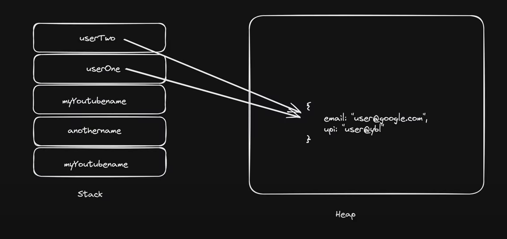
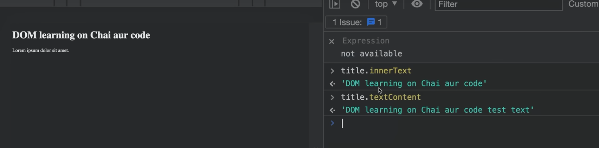
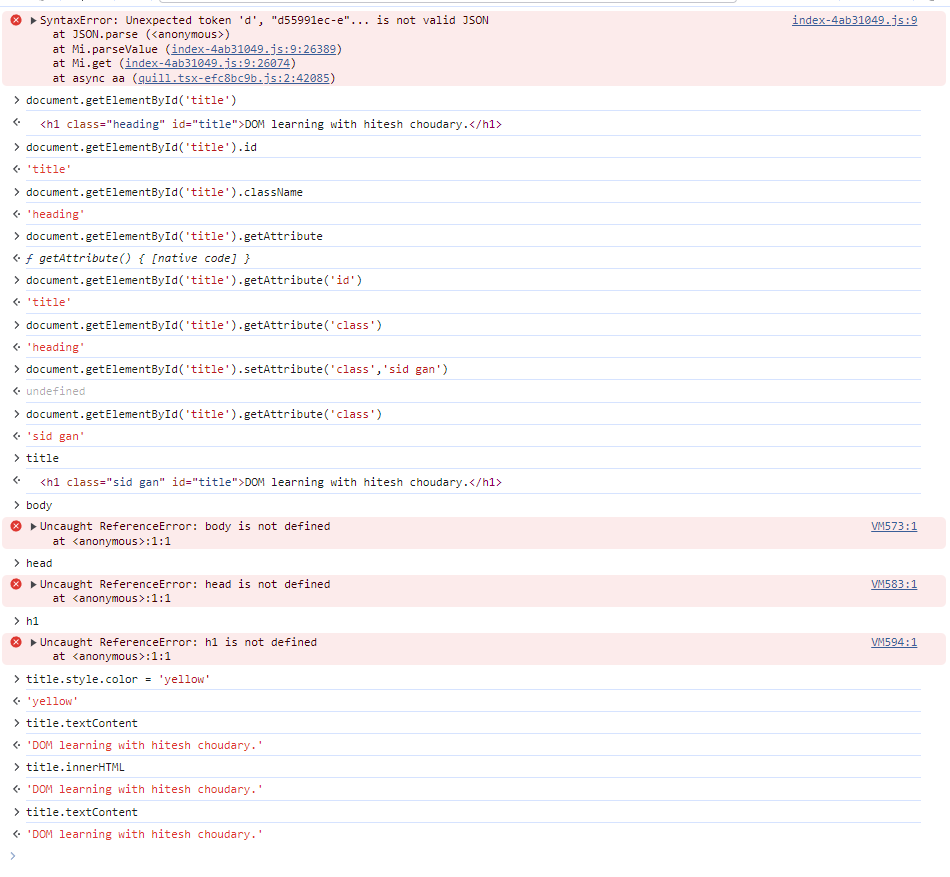
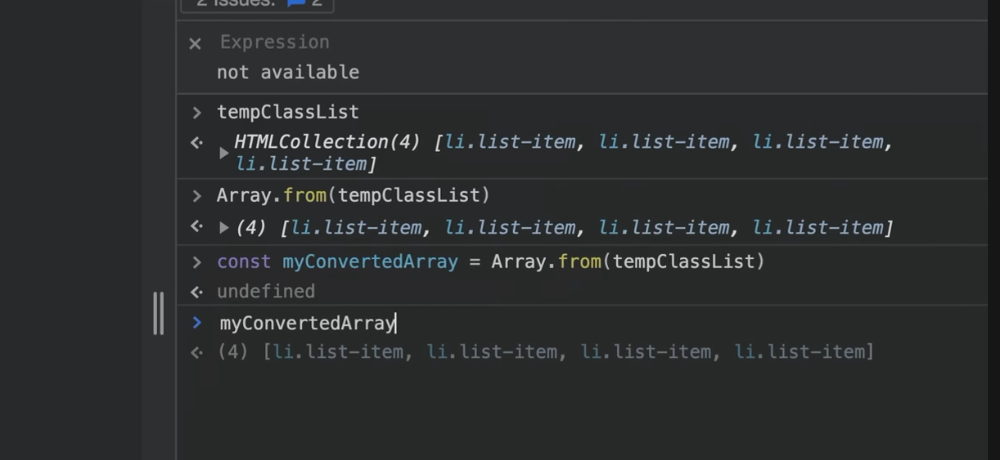

# Javascript for beginners | chai aur #javascript

(confidence in s/w is mandatory.)
(projects are most important.)
(have patience.)



# 2 Setting up environment in local machine for Javascript

NodeJS | Deno
(download the LTS)

IDE'S
VS code
Jet Brains Fleet
Sublime

to check node 
>node -v

To execute the JS file
>node Apple.js

# 3 Save and work on Github for Javascript
To use the CodeSpace in the GitHub.
inside the repo click on CODE -> CODESPACE
then setup the nodejs env
to set -> Cmd Palette -> Add Dev Container config file.
(whatever enviroment u need u can download like NodeJS or python...)

(from github u can download the local project file structure zip file.)

click => NodeJS & JavaScript (devcontainer)

# 4 Let, const and var ki kahani

use let for variable declarations not var.

# 5 Data Types and Ecma Standards
tc39.es/ecma262 and mdn doc


# 6 Datatype conversion confusion


# 7 Why string to number conversion is confusing
conversion
browser gives values as string , for backend it is converted as required.

# 8 Comparison of datatypes in javascript


# 10


```javascript
let myYoutubeName = "ChaiAurCode"
let anotherName = myYoutubeName
console.log(myYoutubeName);
console.log(anotherName);
anotherName = "hiteshChoudary"
console.log(anotherName);

const userOne = {
    email = "jhon@gmail.com",
    upi = "jhon@ybl"
}

const userTwo = userOne

const userTwo.email = "abc@gmail.com"

console.log(userOne.email)
console.log(userTwo.email)

```

# 13 Date and time in depth in javascript


# DOM
display : none







HTMLcollection
NodeCollection

-------------------------------
# js and classes
(not happens)()()

--------------------
# JS backend

## How to setup the professional backend project 

