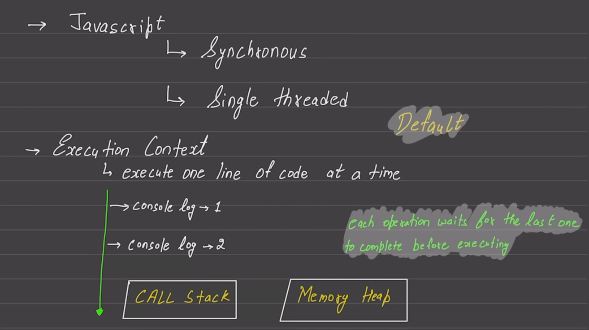
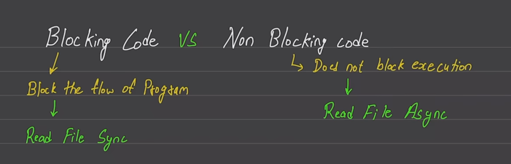
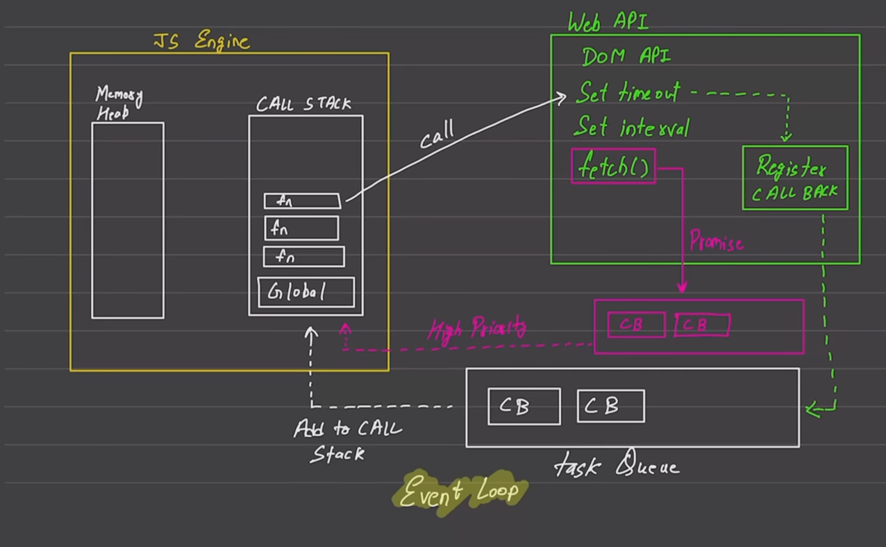
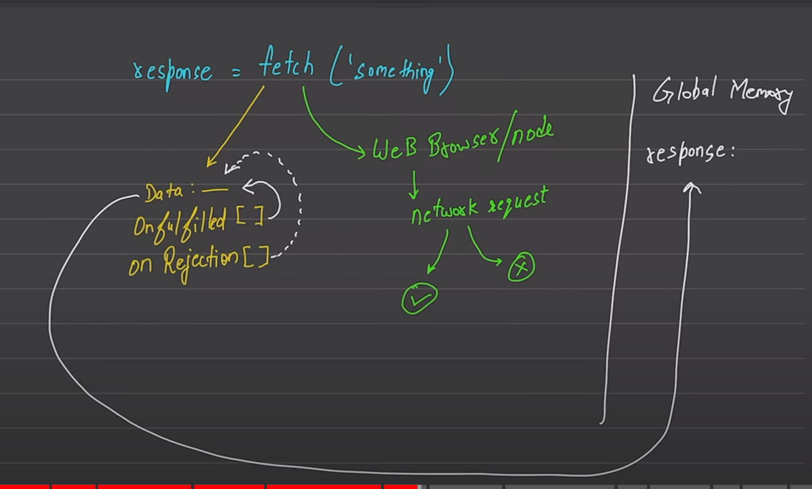
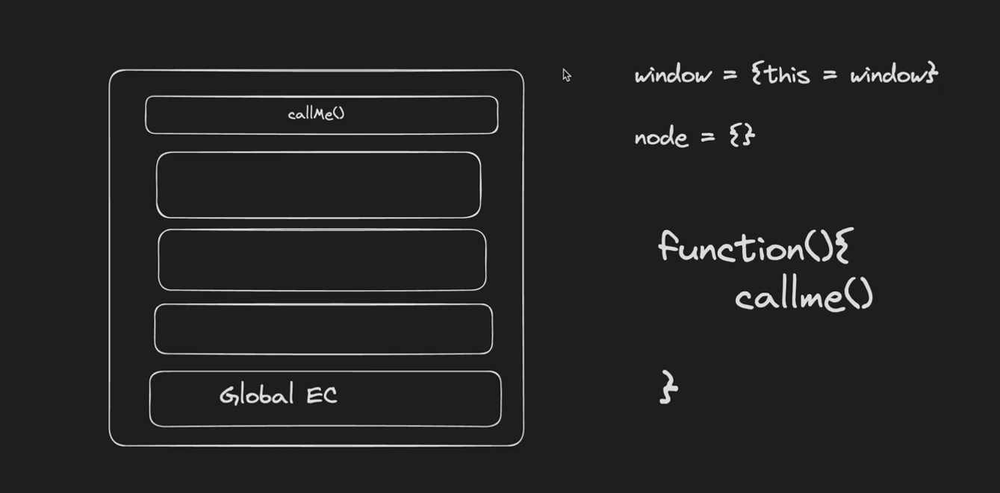
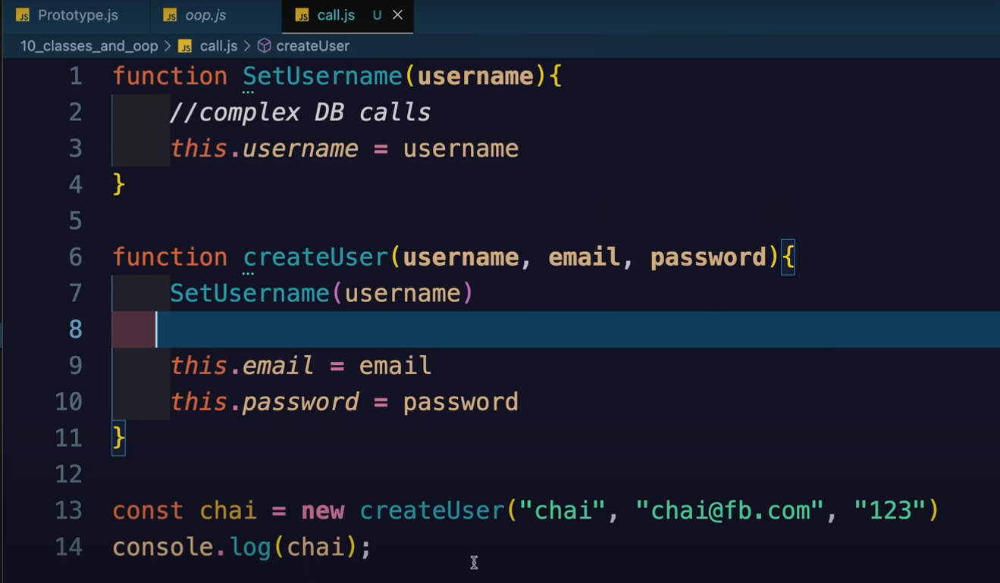
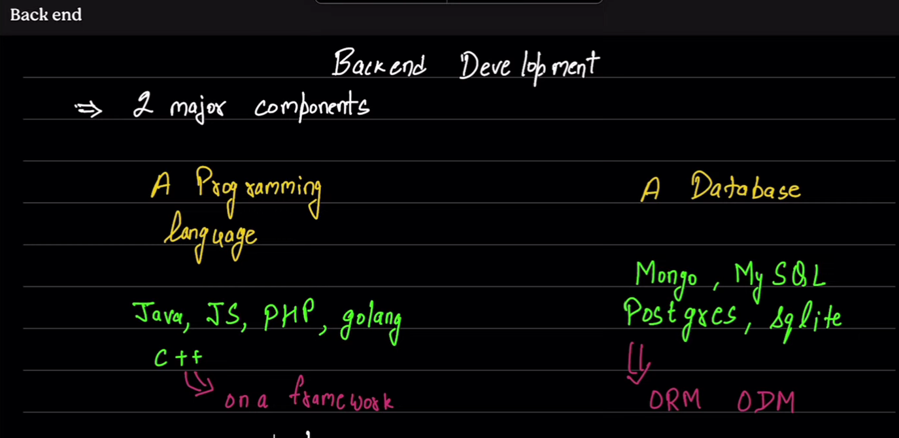
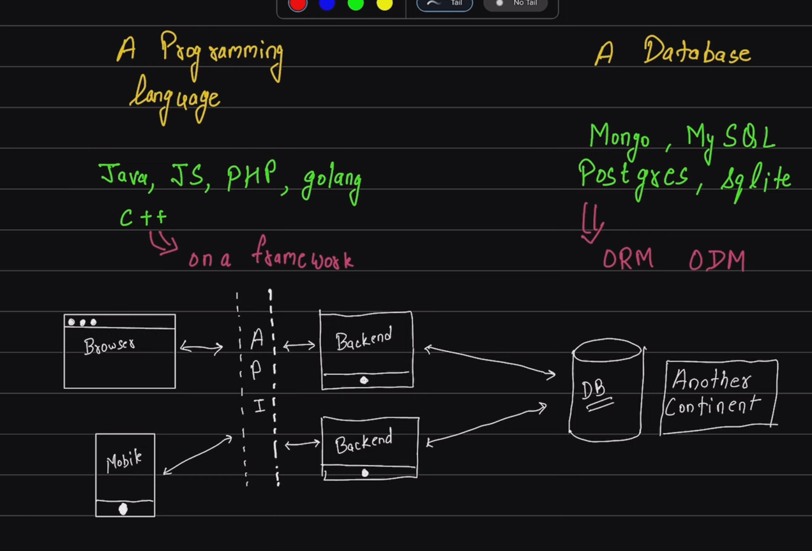
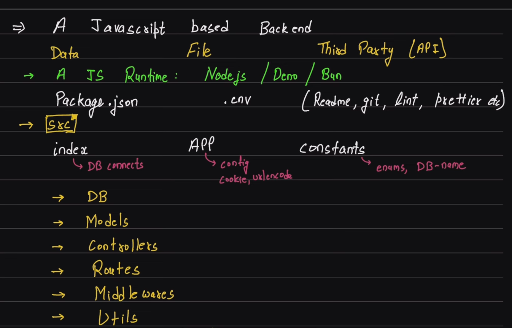

# JavaScript

JS is single threaded and Synchronous (means it executes code in sequential manner.)

(if setTimeout is 1 , 0 , 2 which function executes : )

[Web API] we gets it on browser 

### JS Engine
Browser
NodeJS (DOM api we won't get in it.)
Deno

eg:
API : https://jsonplaceholder.typicode.com/users

---

More(depends)