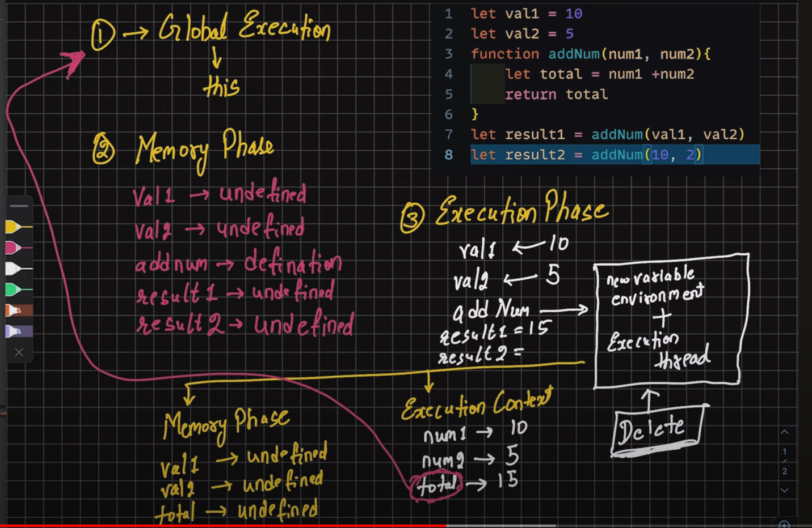
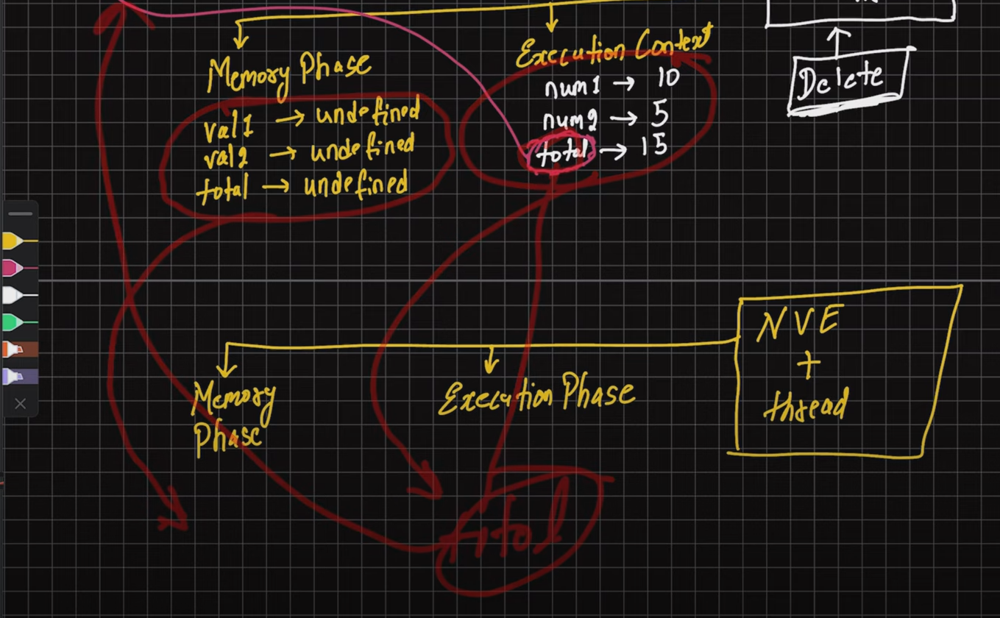
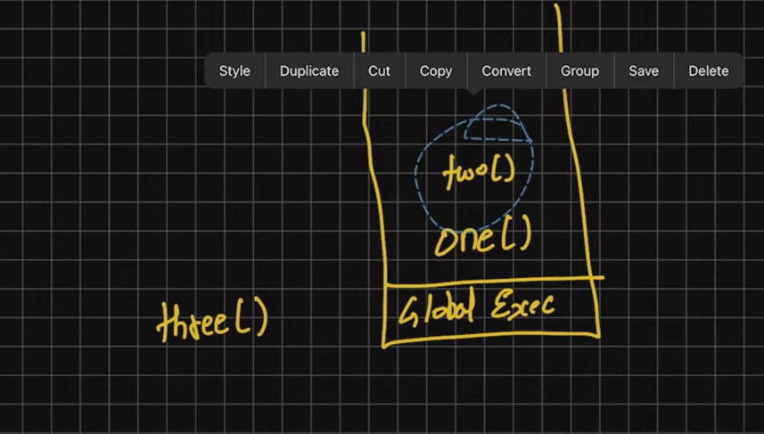

console.log("Helloworld");
variables : var , let , const
constants
datatypes : number 2^53 , bigInt(reddit,trading,stocks), string = "", boolean => false/true , null = it's standalone value, undefined , | symbol = for uniqueness, | object 
"use strict" //use all new version javascript code.
OFFICIAL DOCS OF JS : https://tc39.es/ecma262/   
Docs : tc39 and mdn
console.log(typeof undefined); //undefined
console.log(typeof null); //object
//comparision and equality check both are different.

OPERATORS

DATA TYPES : primitive and non primitive

String
const name = "arjun";
const name2 = new String("arjun");
Inbuilt methods in the String
length
charAt()
indexOf()
substring()
slice()
trim()
replace(,)
includes()
split() //split based on delimiter

Number

Date and it's time (inbuilt methods)

LIFO

---
promise ES6 //call back hell //
const promiseOne = new Promise(function(resolve,reject){
    ///Do an async task
    //DB calls, cryptography, network
    setTimeout(funciton(){
        console.log('Async task is complete');
        resolve()
    }, 1000) 

})

promiseOne.then(function(){
    console.log("promise consumed")
})

fetch

